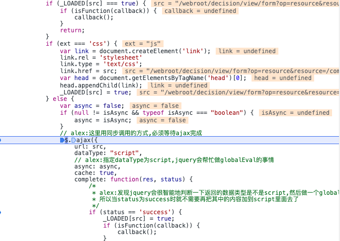
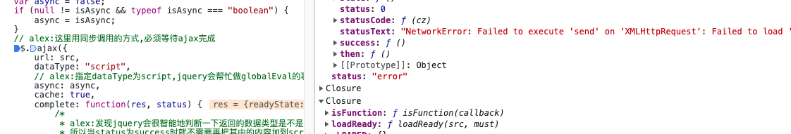

 集成帆软报表遇到一个很奇怪的报错，网上和官方文档上查找很久都没找到解决办法。报错如下：

```
Uncaught ReferenceError: getParamsTemplate is not defined
    at HTMLDocument.<anonymous> (form?viewlet=/eam_report_dev/demoaa.frm:143:34)
    at cc (form?op=emb&resource=finereport.js&inter=zh_CN&__fr_locale__=&jsVersion=1677230036770:116:69)
    at Object.fireWith [as resolveWith] (form?op=emb&resource=finereport.js&inter=zh_CN&__fr_locale__=&jsVersion=1677230036770:117:455)
    at Function.ready (form?op=emb&resource=finereport.js&inter=zh_CN&__fr_locale__=&jsVersion=1677230036770:121:361)
    at HTMLDocument.b6 (form?op=emb&resource=finereport.js&inter=zh_CN&__fr_locale__=&jsVersion=1677230036770:122:204)

```

从报错中可以看出缺少了 `getParamsTemplate ` 导致的报错。

对比其他正常的项目发现页面少加载了部分 js 文件。 根据文件名可以推测就是 `getParamsTemplate ` 所在的文件。


查看源码发现代码是通过 `$defaultImport ` 引入进来的

  ```js 
  FR.$defaultImport('/com/fr/web/core/js/paramtemplate.js', 'js'); 
  ```  
  
  给 `$defaultImport ` 打上断点，进入函数里面发现他是通过 `$.ajax` 来加载的代码
  
  ```js
  // alex:这里用同步调用的方式,必须等待ajax完成
  $.ajax({
      url: src,
      dataType: "script",
     // alex:指定dataType为script,jquery会帮忙做globalEval的事情
     async: async,
     cache: true,
     complete: function(res, status) {
     /*
			* alex:发现jquery会很智能地判断一下返回的数据类型是不是script,然后做一个globalEval
			* 所以当status为success时就不需要再把其中的内容加到script里面去了
			*/
       if (status == 'success') {
         _LOADED[src] = true;
         if (isFunction(callback)) {
            callback();
        }
      }
  }
})
  
  ```
  
  
  
通过断点发现，ajax 的入参都是正确的，函数也正确执行了，但是在控制台的 Network 并没有发现请求。
 经过一番断点调试，控制台没有网络请求，是因为 ajax 发送 xhr 失败了，这个错误信息没有在控制台打印，只能通过调试发现...... 坑
 


```
"NetworkError: Failed to execute 'send' on 'XMLHttpRequest': Failed to load 'http://eam-system-dev.cloud-dev.geega.com/webroot/decision/view/form?op=resource&resource=/com/fr/web/core/js/paramtemplate.js'."

```
  
这个发送失败有点让人摸不着头脑，因为不存在跨域的问题 。通过拼接文件地址在浏览器地址栏打开是能够正常访问文件，猜测是和这个请求有关系。
通过`ajax ` + `NetworkError: Failed to execute 'send' on 'XMLHttpRequest' `  错误信息 为关键词一顿搜索，终于发现线索了 [NetworkError: Failed to execute 'send' on 'XMLHttpRequest': Failed to load xxxx错误解决方法](https://www.codeprj.com/blog/ab04c41.html)


按照文中的方法，在后端的服务中注释了如下代码后，页面终于正常
```java
// SecurityConfiguration.java

@Override
    public void configure(HttpSecurity http) throws Exception {
        // @formatter:off
        http
            .csrf()
            .disable()
            .addFilterBefore(corsFilter, UsernamePasswordAuthenticationFilter.class)
            .exceptionHandling()
            .authenticationEntryPoint(problemSupport)
            .accessDeniedHandler(problemSupport)
        .and()
            // .headers()
            // .contentSecurityPolicy("default-src 'self'; script-src 'self' 'unsafe-inline' 'unsafe-eval'; style-src 'self' 'unsafe-inline'; img-src 'self' data:")
        // .and()
            // .referrerPolicy(ReferrerPolicyHeaderWriter.ReferrerPolicy.STRICT_ORIGIN_WHEN_CROSS_ORIGIN)
        // .and()
            // .featurePolicy("geolocation 'none'; midi 'none'; sync-xhr 'none'; microphone 'none'; camera 'none'; magnetometer 'none'; gyroscope 'none'; speaker 'none'; fullscreen 'self'; payment 'none'")
        // .and()
            // .frameOptions()
            // .sameOrigin()
        // .and()
            .sessionManagement()
            .sessionCreationPolicy(SessionCreationPolicy.STATELESS)
        .and()
            .authorizeRequests()
            .antMatchers("/api/authenticate").permitAll()
            .antMatchers("/api/register").permitAll()
            .antMatchers("/api/activate").permitAll()
            .antMatchers("/api/account/reset-password/init").permitAll()
            .antMatchers("/api/account/reset-password/finish").permitAll()
            .antMatchers("/api/**").authenticated()
            .antMatchers("/management/health").permitAll()
            .antMatchers("/management/info").permitAll()
            .antMatchers("/management/prometheus").permitAll()
            .antMatchers("/management/**").hasAuthority(AuthoritiesConstants.ADMIN)
        .and()
            .httpBasic()
        .and()
            .apply(securityConfigurerAdapter());
        // @formatter:on
    }

```

那么究竟是什么原因导致的问题的发生呢，究竟是那个配置导致的异常
在一堆配置中我敏感的发现了 `sync-xhr 'none’` 这段配置，因为之前页面源码中发送的 `ajax`  他也是同步，我猜测和可能和此有关。

又以 `Chrome featurePolicy` 为关键词查询

FeaturePolicy: 
Feature Policy 是Chrome 推出的一个新的安全头字段，将允许站点启用或禁用某些浏览器功能和API。

sync-xhr 'none' : 禁用站点同步 xhr 请求

所以只要将 `sync-xhr 'none'`  改为 `sync-xhr ‘self’` 即可 

参考资料：
[NetworkError: Failed to execute 'send' on 'XMLHttpRequest': Failed to load xxxx错误解决方法](https://www.codeprj.com/blog/ab04c41.html)
[新的HTTP安全头字段：Feature Policy](https://zhuanlan.zhihu.com/p/43092938)  
[Controlling browser features with Permissions Policy](https://developer.chrome.com/docs/privacy-sandbox/permissions-policy/)
  
  
  