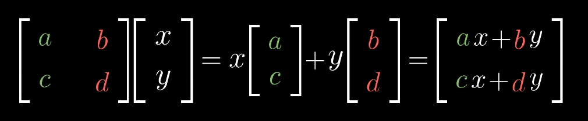

## 目录
- webgl 基础概念
- webgl Hello Word
- webgl 画一个立方体
- 矩阵与图形、缩放、位移、旋转

## webgl 基础概念

> WebGL仅仅是一个光栅化引擎(“光栅化”其实就是“用像素画出来” 的花哨叫法)，它可以根据你的代码绘制出点，线和三角形。 想要利用WebGL完成更复杂任务，取决于你能否提供合适的代码，组合使用点，线和三角形代替实现。
>
> WebGL在电脑的GPU中运行。因此你需要使用能够在GPU上运行的代码。 这样的代码需要提供成对的方法。每对方法中一个叫顶点着色器， 另一个叫片段着色器，并且使用一种和C或C++类似的强类型的语言 GLSL。 (GL着色语言)。 每一对组合起来称作一个 program（着色程序）。
>
> 顶点着色器的作用是计算顶点的位置。根据计算出的一系列顶点位置，WebGL可以对点， 线和三角形在内的一些图元进行光栅化处理。当对这些图元进行光栅化处理时需要使用片段着色器方法。 片段着色器的作用是计算出当前绘制图元中每个像素的颜色值。
>
> 几乎整个WebGL API都是关于如何设置这些成对方法的状态值以及运行它们。 对于想要绘制的每一个对象，都需要先设置一系列状态值，然后通过调用 gl.drawArrays 或 gl.drawElements 运行一个着色方法对，使得你的着色器对能够在GPU上运行

简而言之，webgl的工作类似于画画，先画好线稿，再给线稿上色。顶点着色器就是画线稿，只不过webgl中只有点，线段，三角形三种图形，片段着色器则是给对应的图元计算颜色。

WebGL的剪裁空间是一个规范化的坐标空间，从-1到+1，其中x轴，y轴和z轴分别代表了屏幕的宽度、高度和深度范围。正视看，剪裁空间以屏幕中心为原点，向右为正x轴方向，向上为正y轴方向，向外为正z轴方向。所有位于剪裁空间范围外的几何图元都会被裁剪掉

### 着色器中获取数据的4种方式

1. 属性（Attributes）和缓冲
> 缓冲是发送到GPU的一些二进制数据序列，通常情况下缓冲数据包括位置，法向量，纹理坐标，顶点颜色值等。 你可以存储任何数据。
>
>属性用来指明怎么从缓冲中获取所需数据并将它提供给顶点着色器。 例如你可能在缓冲中用三个32位的浮点型数据存储一个位置值。 对于一个确切的属性你需要告诉它从哪个缓冲中获取数据，获取什么类型的数据（三个32位的浮点数据）， 起始偏移值是多少，到下一个位置的字节数是多少。
>
>缓冲不是随意读取的。事实上顶点着色器运行的次数是一个指定的确切数字， 每一次运行属性会从指定的缓冲中按照指定规则依次获取下一个值。

2. 全局变量
> 全局变量在着色程序运行前赋值，在运行过程中全局有效

3. 纹理（Textures）
> 纹理是一个数据序列，可以在着色程序运行中随意读取其中的数据。 大多数情况存放的是图像数据，但是纹理仅仅是数据序列， 你也可以随意存放除了颜色数据以外的其它数据。

4. 可变量（Varyings）
> 可变量是一种顶点着色器给片段着色器传值的方式。

## 使用 webgl 画一个三角形

- 1. 获取 canvas webgl 上下文
- 2. 新建顶点、片段着色器
- 3. 新建顶点数据，创建缓冲
- 4. 清空画布
- 5. webgl添加做色器程序
- 6. 指定数据缓冲区数据读取方式
- 7. 绘制图元

## 立体图形
绘制立体图形，只要讲点的坐标变为三维坐标即可

## 矩阵

实现物体的位移，缩放，旋转

### 矩阵相乘

### 位移矩阵

### 旋转矩阵

### 缩放矩阵

### 例子

将 (1, 1) 先放大 2 倍，顺时针旋转45度，再沿 x 轴平移 1 

计算过程

## 参考

[坐标绕圆心旋转数学推导](https://blog.csdn.net/zhaitianbao/article/details/120971301)

